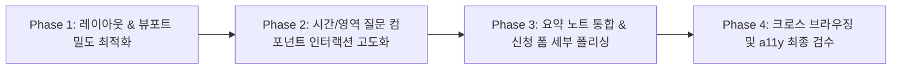

# 데이로그 Life Session 신청폼 UI 수정 및 고도화 기획

> **상태: 과거 기획 기록.** 이 문서의 5단계·요약 화면·무스크롤 목표는 후속 결정으로 대체되었습니다. 현재 기준은 [신청 경험 구현 명세](../05-구현-명세/신청-폼-구현.md)와 [반응형·모션 구현 기준](../05-구현-명세/반응형-모션-구현-기준.md)입니다.

작성일: 2026-08-27  
문서 위치: `신청폼/UI-수정방향-기획.md`  

---

## 1. 기획 배경 및 목적

현재 구현된 신청폼(`application-form`)은 **'LIFE NOTE: 짧은 선택으로 나의 하루를 적다'**라는 브랜드 메타포와 기능적 파이프라인(검증, 트래킹, GAS 연동)이 안정적으로 구축되어 있습니다.

본 기획은 출시 전 사용자 경험(UX) 완성도, 모바일 터치 편의성, 전환율(CVR) 극대화를 위해 UI 디자인과 인터랙션을 고도화하는 구체적인 수정 방향을 정의합니다.

---

## 2. 핵심 디자인 및 UX 원칙

1. **신뢰감 + 따뜻함의 균형**: 
   - Warm Ivory (`#FFF9EF`) 70%, Deep Navy (`#172033`) 20%, Growth Yellow (`#F5B82E`) 10%의 색상 비율 준수.
   - 단순 설문이 아닌 오프라인 60분 Life Session을 위한 '기록과 대화의 시작' 인상 유지.
2. **원 스텝 원 포커스 (One Step, One Focus)**:
   - 한 화면에 한 질문만 노출하여 시선 분산 및 인지 부하 최소화.
3. **선택 피드백의 즉각성**:
   - 긴 글 입력 없이 탭 한 번으로 자연스러운 1인칭 노트 문장이 완성되는 시각적 보상 제공.
4. **모바일 퍼스트 및 저높이(720px 이하) 최적화**:
   - 가상 키보드 및 소형 뷰포트에서도 다음 버튼(CTA)이 가려지지 않는 컴팩트한 밀도 유지.

---

## 3. 화면별 세부 UI 수정 및 개선 과제

### ① [Intro] 첫 화면: 오프라인 세션 신뢰도 및 발견성 강화

| 항목 | 현재 상태 | 개선/수정 방향 |
| :--- | :--- | :--- |
| **운영 정보 안내** | 세션의 장소/방식 안내가 부족해 온라인 서비스로 오해할 소지 있음 | 헤드라인 하단 또는 CTA 부근에 **`진행: 서울 1:1 오프라인`**, **`소요: 60분`**, **`일정: 신청 후 개별 조율`** 3대 핵심 팩트 뱃지 추가 |
| **Hero 뷰포트 밀도** | 1280×720 등 낮은 해상도에서 CTA가 아래로 밀림 | 인트로 상하 여백을 조정하고, 오른쪽 장식용 노트의 크기를 반응형으로 줄여 **스크롤 없이 CTA 100% 노출 보장** |
| **CTA 마이크로카피** | `내 하루 적고 신청하기` | `내 하루 적고 세션 신청하기 →` (보조: `5개의 짧은 선택 · 약 3분 소요`) |

---

### ② [Question 02] '하루의 온도(시간 선택)' UI 인터랙션 고도화

| 항목 | 현재 상태 | 개선/수정 방향 |
| :--- | :--- | :--- |
| **선택 컨트롤** | 2개의 브라우저 기본 `<select>` 드롭다운 | **모바일 친화적 타임 피커**로 개선: 1) 24시간 타임라인 바 형태 또는 2) 주요 시간대(오전/오후/저녁/심야) 탭 + 시간 칩 선택 인터페이스 *(선택 미완료 시 명확한 플레이스홀더 유지)* |
| **시간 대비 시각화** | 단순 텍스트 표시 | 편안한 시간(Warm Ivory/Yellow 톤)과 버거운 시간(Cool Navy 톤)의 칩 색상 대비를 명확히 하여 시각적 직관성 부여 |

---

### ③ [Question 04] '바꾸고 싶은 한 줄' 2단계 선택 UX 정리

| 항목 | 현재 상태 | 개선/수정 방향 |
| :--- | :--- | :--- |
| **1순위 선택 노출** | 영역 선택 시 하단 라디오 칩이 즉시 렌더링되나 화면 아래로 밀릴 수 있음 | 1~3개 선택 시 하단에 부드럽게 펼쳐지는 마이크로 인터랙션 적용. 모바일 화면에서는 9개 영역 카드의 패딩/폰트를 컴팩트하게 조정하여 스크롤 없이 1순위 지정까지 한 화면에 포섭 |
| **영역 마커 정리** | 영문 단일 알파벳 마커(Z, M, E...) 표시 | 브랜드 가이드에 맞춰 영문 약자 대신 **단정한 라벨 텍스트 중심**으로 정리하여 가독성 개선 |

---

### ④ [Summary] '나의 하루 초안' 요약 화면의 편집물 완성도 극대화

| 항목 | 현재 상태 | 개선/수정 방향 |
| :--- | :--- | :--- |
| **정보 중복 제거** | 상단 `RoutineNotebook`과 하단 `<dl class="day-summary">`가 다소 중복 노출됨 | 상단/하단을 통합하여 **실제 한 권의 깔끔한 종이 노트(티켓 형태)**가 완성된 것 같은 단일 카드 뷰로 재구성 |
| **안내 메시지** | 단순 설명 텍스트 | *"이 노트는 평가 결과가 아니라, 첫 만남에서 우리가 함께 펼쳐볼 이야기의 첫 장입니다."*라는 따뜻한 톤앤매너 강조 |
| **보조 기능** | 다음 단계 CTA만 존재 | `내 답변 수정하기` 버튼을 더 명확하게 배치하고, 완성된 노트를 깔끔하게 캡처/복사할 수 있는 사용자 배려 인터랙션 고려 |

---

### ⑤ [Contact] 연락처 및 일정 신청 화면 최적화

| 항목 | 현재 상태 | 개선/수정 방향 |
| :--- | :--- | :--- |
| **선택 정보 아코디언** | 기본 `
` 요소로 다소 밋밋함 | 노트 콘셉트에 맞는 **'일정 및 전하고 싶은 이야기 추가하기 (선택)' 메모지 탭 카드** 스타일로 스타일링 |
| **입력 피드백** | 제출 시에만 에러 표시 | 필드 포커스 아웃(onBlur) 시 가벼운 인라인 힌트 및 올바른 입력 시 부드러운 체크 아이콘 표시 |
| **개인정보 동의 박스** | 기본 체크박스 | Soft Beige 바탕의 작은 동의 메모지 카드 형태로 디자인하여 신뢰감 제고 |

---

### ⑥ [Design Tokens & A11y] 디자인 토큰 및 접근성 고도화

1. **포커스 링 통일**: 키보드 내비게이션 시 Growth Yellow 3px 외곽선 + 2px 오프셋으로 모든 인터랙티브 요소에 일관된 포커스 링 적용.
2. **모션 제어**: `prefers-reduced-motion: reduce` 환경에서 모든 트랜지션을 즉시 변경(0ms)으로 안전하게 폴백.
3. **터치 타겟**: 모바일 내 모든 선택 카드, 칩, 버튼의 최소 터치 영역 44×44px 엄격 준수.

---

## 4. 단계별 실행 계획 (Action Items)

1. **Phase 1: 레이아웃 & 뷰포트 밀도 최적화**
   - 인트로 세션 정보 팩트 뱃지 추가
   - 1280×720 및 모바일 뷰포트 기준 상하 패딩 및 마진 튜닝
2. **Phase 2: 질문 인터랙션 고도화**
   - Question 02 시간 선택 UI 모바일 최적화 (칩/셀렉터)
   - Question 04 영역 선택 시 1순위 라디오 전환 애니메이션
3. **Phase 3: 요약 노트 카드 일원화 & 신청 폼 스타일링**
   - Summary 화면의 중복 텍스트 제거 및 완성형 노트 티켓 컴포넌트 단일화
   - Contact 아코디언 및 동의 박스 메모지 디자인 적용
4. **Phase 4: a11y & 검수**
   - 모바일 Safari/Chrome 실기기 테스트 및 키보드 접근성 검수
